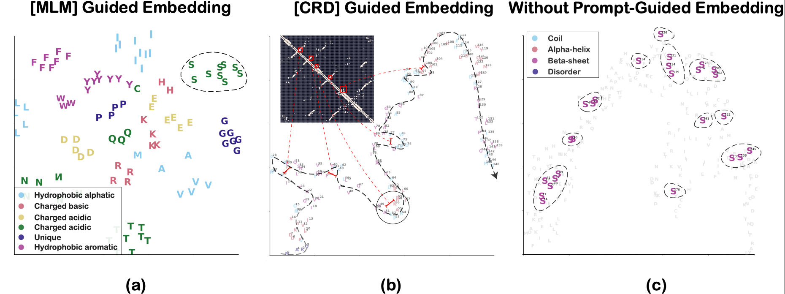
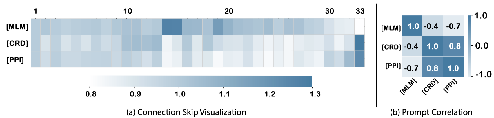

**Prompt engineering is a relatively new discipline to effectively use the knowledge stored in Large Language Models. In contrast to natural language, protein prompts can differ in various forms. In what follows, we present a list of possible prompts that can be leveraged for large protein language models.**

### 1. Dedicated Sentinel Tokens as Prompts

> **[Multi-level Protein Structure Pre-training via Prompt Learning](https://openreview.net/forum?id=XGagtiJ8XC&referrer=%5BAuthor%20Console%5D(%2Fgroup%3Fid%3DICLR.cc%2F2023%2FConference%2FAuthors%23your-submissions)), ICLR 2023**
> 

Protein structures can be divided into four levels: The primal is the protein sequence consisting of amino acids; the second refers to the local folded structures (e.g., $\alpha$ helix and $\beta$ pleated sheet); the tertiary describes the natural folded three-dimensional structure; and the quaternary is a protein multimer comprising multiple polypeptides. A protein can rely on different structure levels to implement its specific functions, including reserving a piece of the sequence, manifesting the whole 3D structure as conformational elements, or even cooperating with other proteins. Therefore, when predicting protein functions, it is vital to flexibly utilize multi-level structural information.

In our ICLR’23 paper, we associate protein structure information to prompts, and flexibly use multi-level structural information through the prompt engineering. Here, we propose three dedicated sentinel tokens `<MLM>`, `<CRD>`, `<PPI>` to associate primary, tertiary, and quaternary structural information.

Let's take a look at the effect of different prompts on protein representation:

The `<MLM>`  leads amino acid embeddings in a protein to group according to their type, and the `<CRD>` leads amino acids to linearly arrange in 2D space along their sequence in the protein. However, the amino acid embeddings, with traditional multi-task pre-training, attempt to merge multiple structural features at the same time, which leads to an unclear pattern.

We also visualized the utilization of each layer by different prompts:

The skip weights are similar in the bottom layers `[1-13]` across all prompts. The primary structural information is mainly acquired by the middle layers `[14-29]`, whereas the tertiary and quaternary structural information is more acquired by the top layers `[30-33]`.

### 2. Aligned Properties as Prompts

The protein generation task can be divided into the generation task of constraining the whole protein and the generation task of constraining each amino acid. The latter is a more rigorous and more concerned generative paradigm for protein research (e.g. inverse folding, proteins that conform to the arrangement of hydrophilic and hydrophobic intervals). 

### 3. Natural language as Prompts

Natural language has demonstrated concept-transferring ability, i.e., transferring semantic concepts from one language to a different one, code or image, in training with other modalities. In order to enable extraction of relevant information from protein LLMs using language, we can augment the protein training data with texts, such that the connection between protein sequences and text descriptions of protein properties (e.g., natural language, XML tables or  knowledge graphs)

### 4. Experimental Installation as Prompts

Experimental installations play an important role in protein generation. They limit and guide the generation of protein, including the guidance of the certain protein, the limitation of the type of protein and the limitation of the process of generating protein. Therefore, it can be cast as one type of prompt in protein generation, bridging the gap between the universal large model and the downstream tasks for the specific-protein generation. The experimental installations include the facilities used in the laboratory and some automatic machines (e.g., iBioFoundry and iChemFoundry).

**Protein language modeling is an emergent topic in the Artificial Intelligence for Science (AI4Science) area, and there are a lot to define and explore. We welcome any technical discussion regarding protein language modeling and beyond.**
